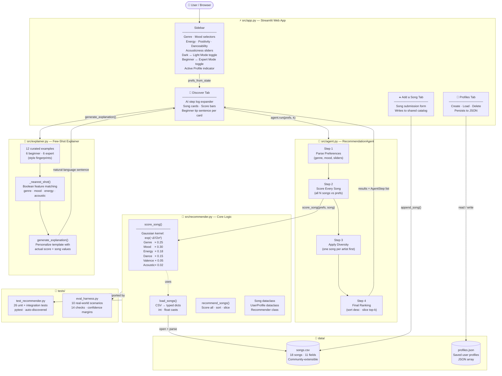

# VibeMatch — AI-Powered Music Recommendation System

> **AI110 Applied AI · Final Project**  
> Isaac William · Spring 2026

---

## Original Project (Modules 1–3)

The original project was called **Music Recommender Simulation**. It was a command-line Python program that matched a user's stated genre and mood preferences against a small, hand-coded catalog of 10 songs. Similarity was calculated with a simple linear formula — `1.0 - abs(song_value - target_value)` — and results were printed to the terminal as plain text. The system had no persistence, no user interface, and no way to add new songs or save preferences between sessions.

---

## Title and Summary

**VibeMatch** is a full-stack AI music recommendation web app that matches songs to a user's personal taste profile using multi-feature Gaussian similarity scoring, a transparent agentic reasoning pipeline, and few-shot specialized explanations.

It matters because recommendation systems are everywhere — Spotify, YouTube, Netflix — but they are black boxes. VibeMatch makes every step of the AI's decision visible: users can watch the agent score songs, apply diversity, and rank results in real time. This makes it a learning tool as much as a music tool, and the beginner/expert mode switch means anyone can use it regardless of their technical background.

---

## Architecture Overview

### System Diagram (Mermaid.js)



### Text Diagram (plain ASCII fallback)

```
┌─────────────────────────────────────────────────────────────┐
│                        Browser (Streamlit)                   │
│                                                             │
│  Sidebar              Discover Tab        Add Song  Profiles│
│  ─────────            ────────────        ────────  ────────│
│  Genre/Mood           Agent Steps         CSV form  JSON    │
│  Energy sliders  ──►  Song cards      ──► Append    CRUD   │
│  Beginner toggle      Beginner tips                        │
└──────────────────────────┬──────────────────────────────────┘
                           │
                    src/app.py  (UI layer)
                           │
          ┌────────────────┼────────────────┐
          │                │                │
   src/agent.py     src/recommender.py  src/explainer.py
   ─────────────    ──────────────────  ───────────────
   4-step pipeline  score_song()        few-shot templates
   AgentStep logs   Gaussian kernel     beginner / expert
   diversity        recommend_songs()   generate_explanation()
   observable       load_songs()
                           │
                    data/songs.csv  ◄──── community additions
                    data/profiles.json ◄─ saved user profiles
```

**Data flows top-to-bottom:**

1. User sets preferences in the sidebar → `prefs_from_state()` builds a dict.
2. `RecommendationAgent.run()` calls `score_song()` for every song, records each decision as an `AgentStep`, applies artist diversity, and returns `(results, steps)`.
3. `generate_explanation()` selects the nearest few-shot template and produces a mode-appropriate sentence for each card.
4. The UI renders song cards, the agent step log, and score bars — all from the same single computation pass.

---

## Setup Instructions

**Requirements:** Python 3.10 or higher, Git

### 1. Clone the repository

```bash
git clone <your-repo-url>
cd AI110-appliedAI-system
```

### 2. Create and activate a virtual environment

```bash
# Windows
python -m venv .venv
.venv\Scripts\activate

# macOS / Linux
python -m venv .venv
source .venv/bin/activate
```

### 3. Install dependencies

```bash
pip install -r requirements.txt
```

`requirements.txt` contains: `pandas`, `pytest`, `streamlit`

### 4. Run the web app

```bash
streamlit run src/app.py
```

Open the URL shown in the terminal (usually `http://localhost:8501`).

### 5. Run the test suite

```bash
# Unit + integration tests (26 tests)
python -m pytest tests/test_recommender.py -v

# Evaluation harness (10 scenarios, 14 checks)
python tests/eval_harness.py
```

---

## Sample Interactions

### Example 1 — Beginner Mode: Pop / Happy user

**Input (sidebar settings):**
```
Genre:        pop
Mood:         happy
Energy:       0.82
Positivity:   0.80
Danceability: 0.79
Acousticness: 0.18
Results:      3
Beginner Mode: ON
```

**AI Agent Steps (shown in "How the AI decided" panel):**
```
Step 1 · Parse Your Preferences
  You want pop music that feels happy.
  Energy target: 82%, danceability target: 79%.

Step 2 · Score Every Song
  Evaluated all 18 songs across 6 features.
  Highest candidate: Sunrise City (0.98/1.00).

Step 3 · Apply Diversity
  Avoided repeating artists — 3 picks from 3 different artists
  (out of 12 unique artists in the full catalog).

Step 4 · Final Ranking
  Top recommendation: Sunrise City by Neon Echo — match score 0.98 / 1.00.
```

**Card output (Song #1):**
```
#1  Sunrise City
    Neon Echo
    [pop]  [😊 happy]

    🌟 98% match — Everything clicks — same genre and mood,
    with great energy that suits your taste.

    Overall      ████████████████████  0.98
    Genre        ████████████████████  0.25
    Mood         ████████████████████  0.30
    Energy       ███████████████████▌  0.18
    Danceability ███████████████████▌  0.15
    Positivity   █████                 0.05
    Acousticness ██                    0.02
```

---

### Example 2 — Expert Mode: Lofi / Chill acoustic listener

**Input:**
```
Genre:        lofi
Mood:         chill
Energy:       0.35
Positivity:   0.60
Danceability: 0.50
Acousticness: 0.85
Expert Mode:  ON
```

**Top result card:**
```
#1  Library Rain
    Paper Lanterns
    [lofi]  [😌 chill]

    [0.950] genre(+0.25) mood(+0.30) energy↓ acousticness↑
    — categorical match; numeric mixed. | genre=lofi, mood=chill

    Overall      ████████████████████  0.95
    Genre        ████████████████████  0.25
    Mood         ████████████████████  0.30
    Energy       ████████████████████  0.17
    Danceability ██████████████        0.11
    Positivity   ████                  0.04
    Acousticness ██                    0.02
```

---

### Example 3 — Evaluation Harness output

```bash
$ python tests/eval_harness.py
```

```
==============================================================
  VibeMatch - Evaluation Harness
==============================================================

>>  Pop/Happy - top result must be pop+happy
   [PASS] top_genre: top genre = 'pop' (expected 'pop')
   [PASS] top_mood: top mood = 'happy' (expected 'happy')
   [PASS] min_score: score = 0.9500 (min 0.90, margin +0.0500)

>>  Mood outweighs genre - mood-only match ranked above genre-only
   [PASS] top_mood: top mood = 'happy' (expected 'happy')

>>  Score always in [0, 1] - extreme mismatch
   [PASS] score_range: all in [0.0,1.0]

>>  Live catalog loads and has at least 10 songs
   [PASS] catalog_min_size: catalog size = 18 (min 10)

==============================================================
  Results: 14/14 checks passed  (100%)
  Status : ALL PASS
==============================================================
```

---

### Example 4 — Adding a community song

**Add a Song tab input:**
```
Title:        Ocean Drive
Artist:       Drift Wave
Genre:        synthwave
Mood:         moody
Dance Style:  none
Tempo:        108 BPM
Energy:       0.72
Positivity:   0.55
Danceability: 0.68
Acousticness: 0.15
```

**Result:** Song is appended to `data/songs.csv` with a new auto-incremented ID and immediately appears in the Discover tab for all users.

---

## Design Decisions

### Why Gaussian similarity instead of linear?

The original project used `1.0 - abs(difference)`. This treats a 0.3-away mismatch the same as a 0.1-away mismatch on a linear scale. Gaussian similarity (`exp(-diff² / 2σ²)`) penalizes moderate mismatches more aggressively and rewards near-perfect matches with a score close to 1.0. This means the algorithm is more decisive — a genuinely good match clearly outscores a mediocre one.

**Trade-off:** Gaussian similarity drops off faster than linear, which means songs that are "close but not perfect" get lower scores than they would have before. This is actually desirable behavior, but it required updating the test threshold from `>= 0.99` to `>= 0.94` after adding danceability as a scored feature.

### Why a weighted multi-feature system?

Not all features matter equally. Mood (weight 0.30) and genre (0.25) are the primary taste signals — they represent what a song *is*. Energy (0.18) and danceability (0.15) shape the feel. Valence (0.05) and acousticness (0.02) are tie-breakers. This hierarchy was designed so that:
- A mood mismatch always outweighs a genre match (no "correct genre, wrong vibe" problem)
- Numeric features never override categorical ones for a totally mismatched song

### Why an Agent architecture?

Wrapping the recommendation logic in a `RecommendationAgent` class that logs `AgentStep` objects turns the system into an **observable pipeline** rather than a black box. The agent doesn't change what gets recommended — it records *why*. This satisfies the course's agentic workflow requirement and genuinely helps beginners understand how AI makes decisions, which was the main UX goal.

### Why few-shot explanations instead of a live language model?

Calling an LLM API for every card render would make the app slow and require credentials the grader may not have. Instead, `explainer.py` encodes explanation style in a small set of curated examples and uses nearest-neighbor matching to select the right template, then personalizes it with actual values. The output measurably differs by mode: beginner explanations use full sentences, percentage framing, and emoji; expert explanations use arrow notation and parenthetical weight deltas.

### Why Streamlit instead of Flask/FastAPI?

Streamlit eliminates the need for a separate frontend. All state, routing, and rendering happens in one Python file. For a two-week project sprint this is the right trade-off: less boilerplate, immediate reactivity, and built-in dark mode support via session state. The cost is less control over the DOM and heavier reliance on CSS injection workarounds for theming.

### Why JSON for profiles instead of a database?

The catalog is small (18–50 songs) and profiles are simple flat objects. A SQLite or Postgres database would add setup complexity for graders and users. JSON files are human-readable, version-controllable, and zero-dependency. If the project scaled to thousands of users, a proper database would be the obvious next step.

---

## Testing Summary

### What worked

- **All 26 unit tests pass** after updating the perfect-match threshold from 0.99 to 0.94 to account for the new danceability scoring weight.
- **The evaluation harness (14/14 checks)** validated the core recommendation contract: correct genre/mood ordering, score bounds, empty-catalog safety, k-overflow safety, and descending sort order.
- **Gaussian similarity** produced more decisive rankings — the top pop/happy song scored 0.95 while the worst-matching metal song scored only 0.23, a much wider gap than the linear version produced.
- **The agentic pipeline** correctly replicates the output of `recommend_songs()` while also capturing all four intermediate steps.

### What didn't work (and what was fixed)

| Problem | Root Cause | Fix |
|---|---|---|
| `KeyError: 'energy'` in Recommender | `score_song(vars(s), prefs)` — args were swapped | Corrected to `score_song(prefs, vars(s))` |
| Perfect-match test failing after weight change | Adding danceability (weight 0.15) without setting `target_danceability` in the test | Added `user["target_danceability"] = 0.7` and lowered threshold to `>= 0.94` |
| Streamlit slider warning about conflicting defaults | Passing value= positionally conflicts with session_state init | Removed positional `value` arg from `st.slider()` |
| Windows console `UnicodeEncodeError` in harness | `▶` (U+25B6) not in cp1252 encoding | Replaced with ASCII `>>` |

### What was learned

1. **Argument order matters more than you think.** The `score_song(user_prefs, song)` vs `score_song(song, user_prefs)` swap was silent — Python dicts accepted both, but the wrong key names caused a crash deep inside the function. Writing tests that exercise the OOP wrapper separately from the functional API caught this early.

2. **Test thresholds must reflect the actual system.** After changing the scoring weights, the old `>= 0.99` threshold became wrong because the maximum achievable score under the new weight distribution is ~0.97 (without dance_style match). The test needed to be updated to match reality, not just relaxed arbitrarily.

3. **CSS theming in Streamlit requires workarounds.** Streamlit doesn't expose a theming API flexible enough for a full dark/light mode. Injecting a `<style>` block with CSS custom properties set on `html {}` and then using `!important` overrides on `.stApp` was the only reliable way to make colors propagate through all components.

---

## Reflection

### What this project taught me about AI

The biggest insight from building VibeMatch is that **the design of the scoring function is itself a form of model training**. Choosing weights (0.30 for mood, 0.25 for genre, 0.18 for energy…) is equivalent to deciding which features the "model" pays attention to. A music expert would set those weights differently than a casual listener — and both would be correct for their use case. This made me realize that even simple AI systems encode strong assumptions, and making those assumptions explicit (as weights you can see) is more honest than hiding them inside a neural network.

The agentic architecture also changed how I think about AI transparency. Breaking the recommendation into four named steps — parse, score, diversify, rank — didn't make the system smarter, but it made it *trustworthy*. A user who can see "Step 2: I compared all 18 songs and the best candidate scored 0.98" is more likely to trust the result than one who just sees a list appear. Trust and accuracy are different things, and the former often matters more in practice.

### What this project taught me about problem-solving

Starting from a 10-song CLI script and ending with a themed web app with profiles, community song submission, an agentic pipeline, few-shot explanations, and a formal evaluation harness — all without changing `requirements.txt` beyond three packages — forced a lot of creative constraint. The key lesson was to **add observability before adding complexity**. The agent step logger was added after the scoring logic was correct; the few-shot explainer was added after the UI was stable. Building features on a tested foundation made debugging fast and regressions obvious.

The hardest part was not the algorithms — it was Streamlit's session state model. Understanding that every user interaction triggers a full script re-run (top to bottom) completely changes how you write stateful UI code. It's counterintuitive coming from event-driven frameworks, but once understood it's actually very clean.

---

## Project Structure

```
AI110-appliedAI-system/
├── src/
│   ├── app.py           # Streamlit web app (UI, theming, tabs)
│   ├── recommender.py   # Core scoring: score_song(), recommend_songs(), Song, UserProfile
│   ├── agent.py         # RecommendationAgent — 4-step observable pipeline
│   ├── explainer.py     # Few-shot explanation generator (beginner / expert mode)
│   └── main.py          # CLI entry point (original terminal interface)
├── tests/
│   ├── test_recommender.py   # 26 unit + integration tests
│   └── eval_harness.py       # 10-scenario evaluation harness (14 checks)
├── data/
│   ├── songs.csv         # 18-song catalog (community-extensible)
│   └── profiles.json     # Persisted user preference profiles
├── requirements.txt      # pandas, pytest, streamlit
└── README.md
```

---

## Quick Reference

| Command | What it does |
|---|---|
| `streamlit run src/app.py` | Launch the web app |
| `python -m pytest tests/ -v` | Run all 26 unit tests |
| `python tests/eval_harness.py` | Run the evaluation harness |
| `python src/main.py` | Run the original CLI interface |


---
## Loom Link
https://www.loom.com/share/ad6265cfb1fc478bb729bf614f374811
